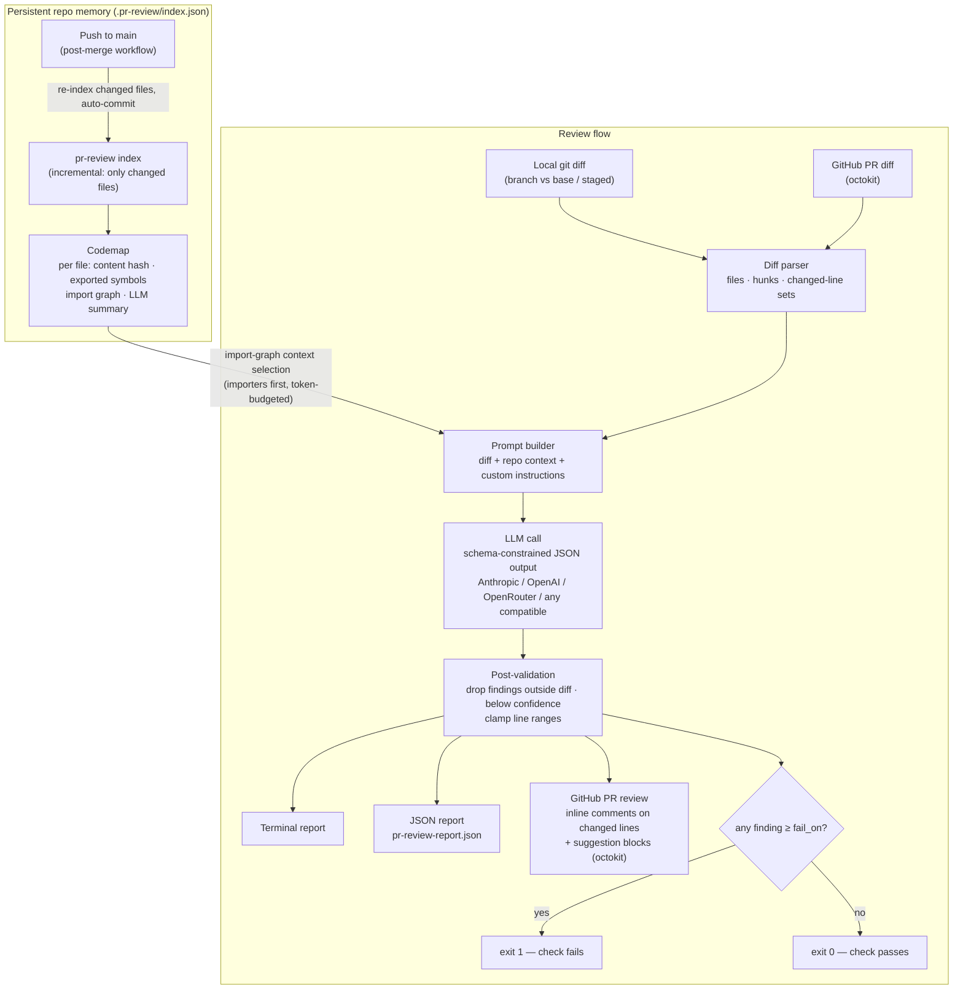

# pr-review-agent

**LLM-powered pull request review with whole-repository context.**
A CLI + GitHub Action that reviews diffs the way a senior engineer would — knowing the codebase, not just the patch.

## The problem

Manual PR review is one of the most expensive rituals on a team: reviews queue for hours or days, standards drift between reviewers, and the same classes of bugs (off-by-ones, missing tests, unvalidated input) slip through when reviewers are tired. Existing LLM reviewers help, but most of them see **only the diff** — so they miss broken callers, flag "issues" the codebase already handles elsewhere, and can't judge naming or conventions against the rest of the project.

`pr-review-agent` fixes that with a **persistent codemap**: a compact, incrementally-updated index of every file in the repo (exported symbols, import graph, and a one-paragraph LLM summary per file). At review time, the import graph selects the files most relevant to the change — the direct **importers** of changed files (the code that breaks if the change is wrong) and their direct **imports** (the APIs the change relies on) — and injects their summaries into the review prompt under a strict token budget. The reviewer sees the project, not just the patch, without paying to re-read the whole repo on every PR.

After each merge, a workflow re-indexes **only the files that changed** and commits the updated codemap — so the agent's memory of the project stays current as the codebase evolves.

## Architecture



## What it flags

| Category | Examples |
|---|---|
| `bug` | logic errors, off-by-ones, broken error handling, wrong API usage |
| `security` | injection, secrets in code, missing validation at trust boundaries |
| `missing-tests` | new/changed behavior with no test change |
| `naming` | identifiers inconsistent with the codebase's conventions |
| `complexity` | over-long functions, logic duplicated from elsewhere in the repo |
| `custom` | anything your `.pr-review.yml` custom instructions ask for |

Every finding carries a severity (`critical`→`info`), a category, a model-rated confidence, a markdown explanation, and — where possible — a drop-in fix rendered as a GitHub **suggested change**. Findings the model invents outside the diff are dropped by post-validation, and low-confidence findings are filtered by a configurable floor, so the output is a gate, not noise.

## Setup

### 1. CLI (local)

```bash
npm install && npm run build     # from a clone
# or: npm install -g pr-review-agent

export ANTHROPIC_API_KEY=sk-ant-...   # see "Providers" for alternatives

# Build the repo memory (one-time; incremental afterwards)
pr-review index

# Review your branch against origin/main (auto-detected)
pr-review review

# Other modes
pr-review review --staged             # review staged changes
pr-review review --base origin/develop
pr-review review --fail-on critical   # override the gate threshold
pr-review index --no-llm              # symbols + import graph only, no API key needed
```

`review` prints a colored terminal report and writes `pr-review-report.json`. Exit code is `1` when any finding is at or above the `fail_on` threshold.

### Providers

The Anthropic API is the default (official SDK, schema-constrained output). Any OpenAI-compatible endpoint also works:

| Provider | Env vars |
|---|---|
| Anthropic (default) | `ANTHROPIC_API_KEY` (model defaults to `claude-opus-4-8`; override with `PR_REVIEW_MODEL`) |
| OpenRouter | `OPENROUTER_API_KEY` + `PR_REVIEW_MODEL` (e.g. `anthropic/claude-sonnet-4.5`) |
| OpenAI | `OPENAI_API_KEY` + `PR_REVIEW_MODEL` (e.g. `gpt-4o`) |
| Any OpenAI-compatible endpoint (LiteLLM, vLLM, Together, …) | `PR_REVIEW_BASE_URL` + `PR_REVIEW_API_KEY` + `PR_REVIEW_MODEL` |

Force a provider with `PR_REVIEW_PROVIDER=anthropic|openai|openrouter|openai-compatible`; otherwise it's inferred from which key is set.

### 2. GitHub Action (in another repo)

Add the review workflow — see [`examples/pr-review.yml`](examples/pr-review.yml):

```yaml
name: PR Review
on:
  pull_request:
    types: [opened, synchronize, reopened]
permissions:
  contents: read
  pull-requests: write
jobs:
  review:
    runs-on: ubuntu-latest
    steps:
      - uses: YOUR_GITHUB_USERNAME/pr-review-agent@v1
        with:
          anthropic-api-key: ${{ secrets.ANTHROPIC_API_KEY }}
          fail-on: high
```

Then add the **codemap update workflow** so the repo memory stays current after every merge — see [`examples/update-index.yml`](examples/update-index.yml). It runs `pr-review index` on pushes to `main` (re-indexing only the changed files) and commits `.pr-review/index.json` back.

Findings are posted as **one PR review** with inline comments scoped to the changed lines only; comments already posted by a previous run are not duplicated on re-push. The check fails only when a finding is at or above `fail-on`.

### 3. Configuration (`.pr-review.yml`)

Place at the consuming repo's root — see [`examples/.pr-review.yml`](examples/.pr-review.yml):

```yaml
fail_on: high              # gate threshold: critical|high|medium|low|info
min_confidence: 0.5        # drop findings the model rated below this
ignore:
  - "**/*.gen.ts"          # excluded from review and from the codemap
context_token_budget: 8000 # token budget for injected repo context
custom_instructions: |
  Flag missing JSDoc on exported functions.
categories:
  naming: false            # disable a category entirely
```

## Sample output

> 📸 *Screenshot of a generated PR review comment goes here after the first real run.*

Terminal report:

```
PR Review

Rewrites sum() with a manual loop; the loop bound is incorrect.

src/math.ts
  HIGH [bug] L2-3 Loop reads past the end of the array (95%)
      `i <= xs.length` accesses xs[xs.length] (undefined), making the total NaN.

1 finding(s): 1 high
```

## How the memory works

1. **`pr-review index`** walks the repo (respecting `.gitignore` + your `ignore` patterns) and stores, per file: a content hash, exported symbol signatures and resolved relative imports (TypeScript compiler API for TS/JS, regex heuristics for other languages), and a one-paragraph LLM summary (batched calls; skipped with `--no-llm`).
2. Runs are **incremental**: only files whose content hash changed are re-extracted and re-summarized; deleted files are pruned. A post-merge workflow keeps the committed index in sync with `main`.
3. At review time, **context selection is deterministic** — no extra LLM call. For each changed file the import graph yields its importers and imports, ranked by how many changed files they touch, packed into `context_token_budget`. That context rides in the prompt alongside the annotated diff.

The index lives at `.pr-review/index.json` in the consuming repo: transparent, versioned with the code, and identical for local runs and CI.

## Development

```bash
npm install
npm run build       # tsc → dist/
npm test            # vitest — LLM calls are mocked, no network
npm run typecheck
```

## License

MIT
